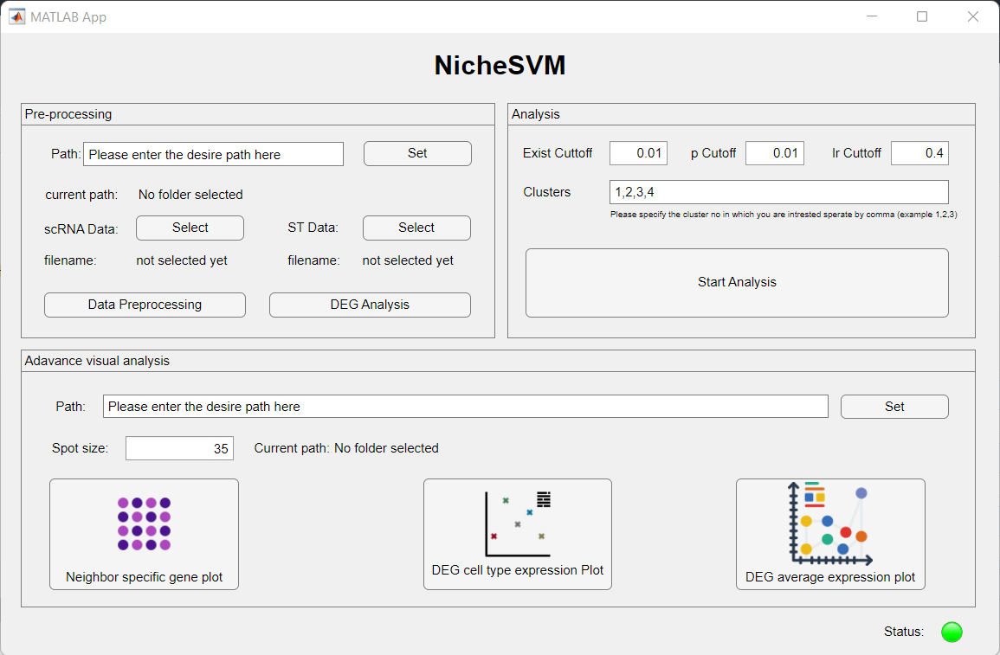
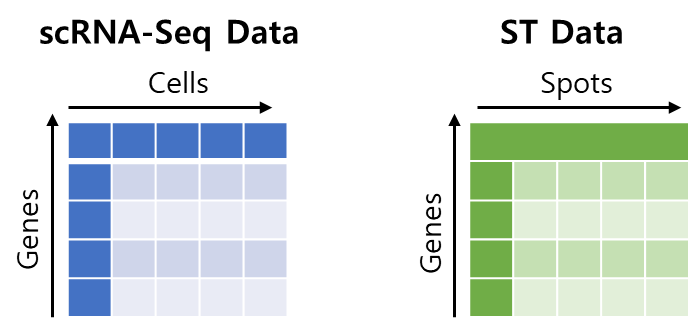

# Welcome to NicheSVM GUI: Unveiling Niche-Specific Gene Signatures in Tumor Microenvironments

NicheSVM GUI is an intuitive and user-friendly graphical interface for analyzing single-cell and spatial transcriptomics data, specifically designed to uncover niche-specific gene signatures within tumor microenvironments. This tool uses support vector machines (SVMs) and statistical analysis to find unique gene sets that describe the interactions and expressions of neighboring cell types in a tissue microenvironment.

## About NicheSVM

NicheSVM GUI is an extension of the original NicheSVM framework, which was made for analyzing Physically Interacting Cell Sequencing (PIC-seq) data. It has been changed so that it can handle 10X Visium data without any problems. The tool uses multiclass SVMs to separate spatial transcriptomic data, which makes it possible to find gene sets that are unique to the area of cells in a given space. This concept introduces the idea of 'niche-specific genes,' whose expression is enriched when distinct cell types are co-localized within close proximity (approximately 55 micrometers) of each other.

## Key Features

- **Integration of scRNAseq and Spatial Transcriptomic Data:** NicheSVM GUI integrates single-cell RNA sequencing (scRNAseq) and spatial transcriptomic (ST) data in a way that is easy to understand. This makes it possible to look at gene activity in tissue samples in a complete way.
 
- **Niche-Specific Gene Analysis:** The tool employs statistical analysis to identify gene sets that are specific to cellular niches, providing valuable insights into cell-cell interactions and communication within complex tissue microenvironments.
 
- **User-Friendly Interface:** NicheSVM GUI offers an intuitive graphical user interface (GUI) built using MATLAB, making it accessible and easy to use for both researchers and practitioners, without requiring extensive programming expertise.

## How to Get Started

To begin using NicheSVM GUI, simply follow the installation and analysis instructions.

- **Installation instructions:**
  - Step 1: Download the NicheSVM GUI software.
  - Step 2: Download a MATLAB runtime environment.
  - Step 3: Install the software by following the prompts.

- **Analysis instructions:**
  - Step 1: Convert your single cell and ST data into a txt file according to the software format specified in the following image file.

  - Step 2: Set the desired path where you want to save all the analysis files generated by the software.
  - Step 3: Upload the Single Cell and ST data using two "Select" buttons in the pre-processing section.
  - Step 4: Press the "Data Preprocessing" button.
  - Step 5: Choose the appropriate thresholds and the number of clusters according to your analysis criteria.
  - Step 6: Press the "Start Analysis" button and wait for the lamp to turn back to green light, a pop-up message will appear with the completion of the analysis.
